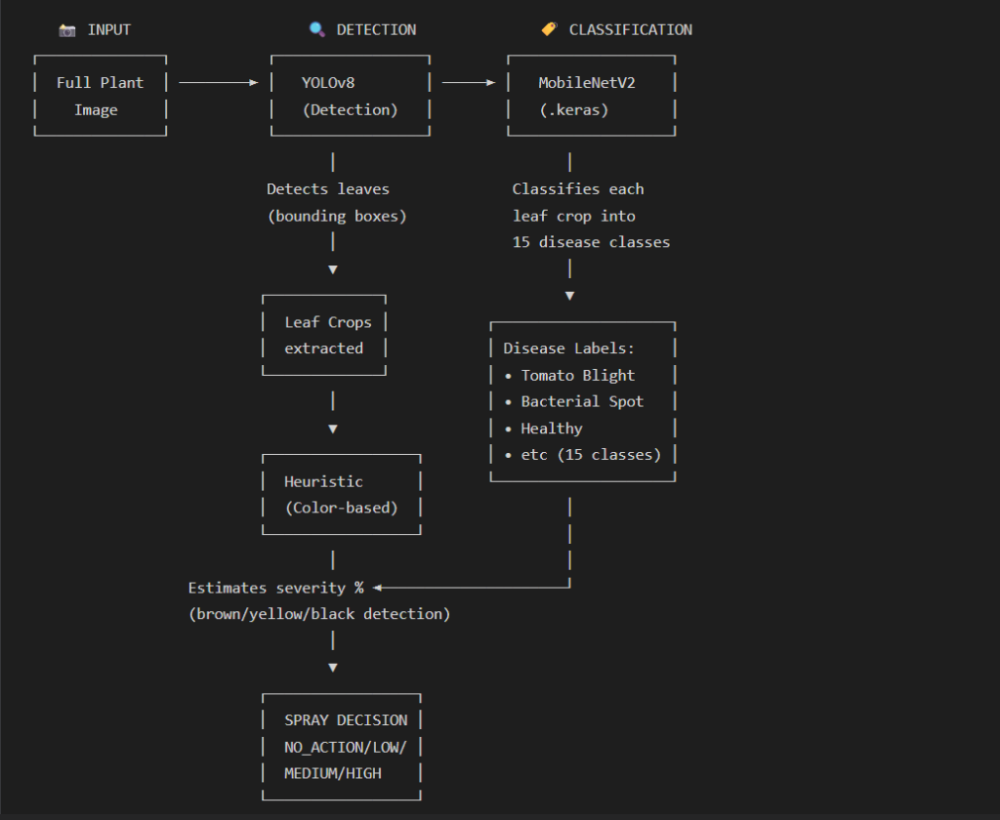
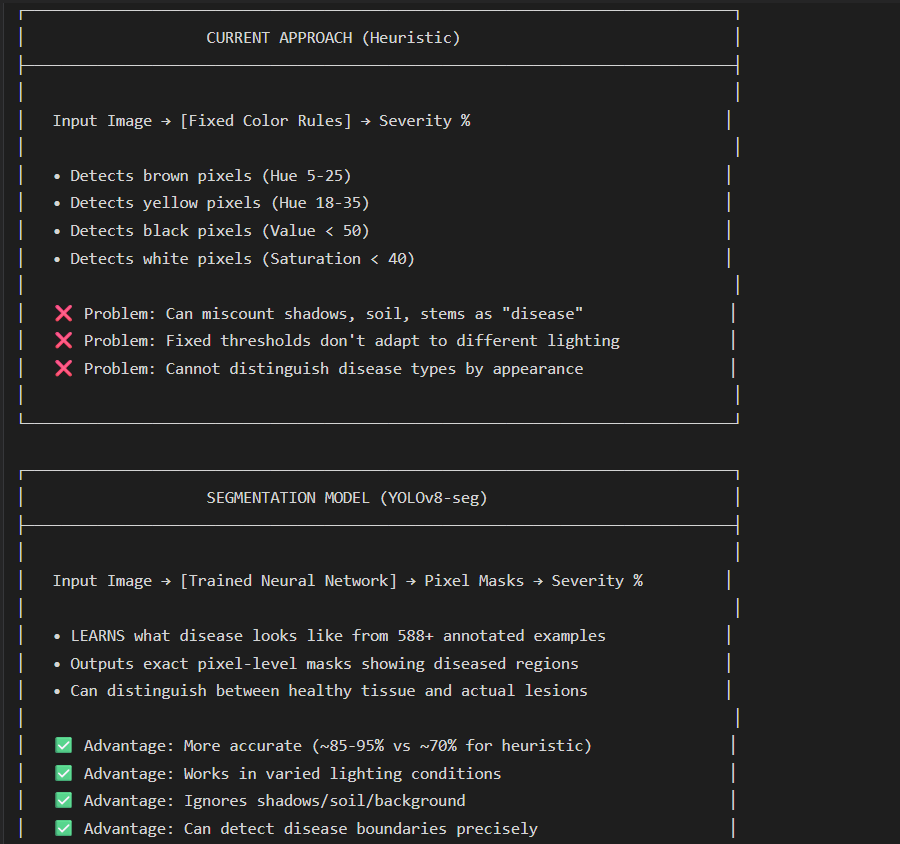
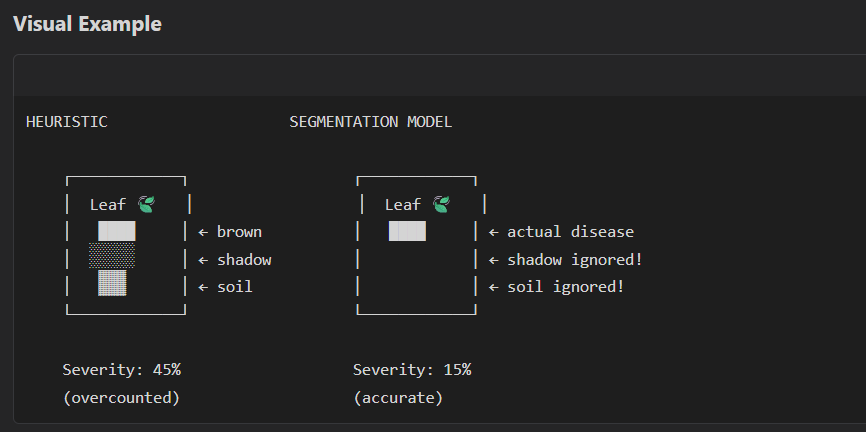

# 🌿 Plant Disease Detection & Severity Estimation

[](https://www.python.org/)
[](https://tensorflow.org/)
[](https://ultralytics.com/)
[](https://streamlit.io/)

An intelligent plant disease detection pipeline using **YOLOv8** for leaf detection, **MobileNetV2** for disease classification, and **YOLOv8-seg** for accurate severity estimation with spray recommendations.

---
# 

## 🔄 Pipeline Architecture



---

## 🎯 Severity Estimation

### Heuristic vs Segmentation Model





---

## ✨ Features

| Feature | Description |
|---------|-------------|
| 🔍 **Leaf Detection** | YOLOv8 detects individual leaves |
| 🏷️ **Disease Classification** | 15 disease classes (Tomato, Potato, Pepper) |
| 🔬 **Segmentation Severity** | YOLOv8-seg for accurate (~85-95%) severity |
| 📊 **Heuristic Fallback** | Color-based analysis if no seg model |
| 🎯 **Spray Tiers** | NO_ACTION → LOW → MEDIUM → HIGH |

---

## 🚀 Quick Start

```bash
# Install
pip install -r requirements.txt

# Run Web UI
streamlit run scripts/streamlit_app.py
```

**Models Required:**
| Model | Path | Purpose |
|-------|------|---------|
| YOLOv8 Detection | `models/yolov8_leaf.pt` | Leaf detection |
| MobileNetV2 | `models/mobilenetv2_disease.keras` | Disease classification |
| YOLOv8 Segmentation | `models/yolov8_seg.pt` | Severity estimation ⭐ |

---

## 🎚️ Settings Guide

| Setting | Value | Use Case |
|---------|-------|----------|
| **YOLO Confidence** | 0.35 | General use ✅ |
| **Segmentation Toggle** | ON | More accurate severity |

---

## 👨‍💻 Author

**Anuj Tripathi** | EDP Project

---
